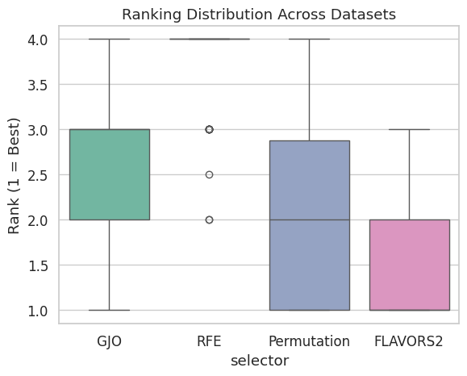
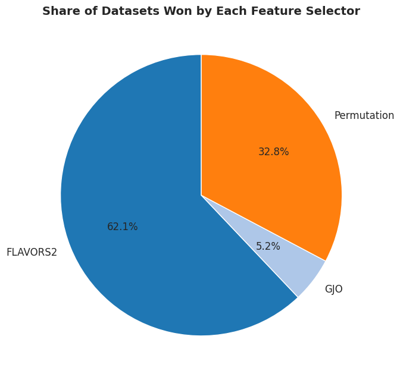
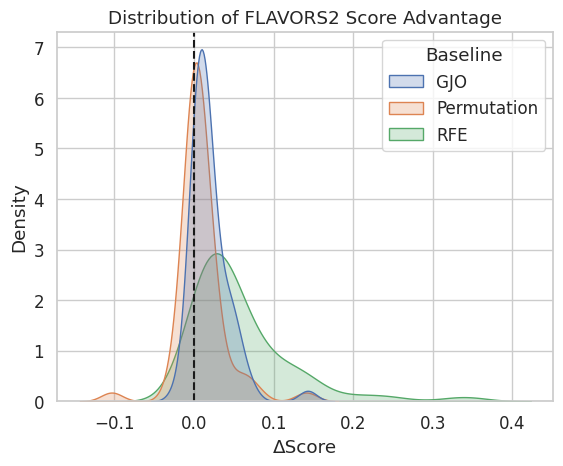
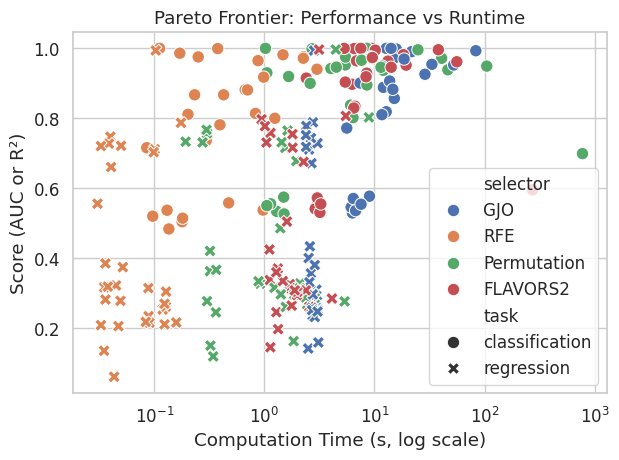

---


**FLAVORS2 (Fast and Lightweight Assessment of Variables for Optimally-Reduced Subsets towards Feature Learning Automation with Variable-Objective, Resource Scheduling)** is an efficient feature selection library for machine learning. It automates the search for optimal feature subsets under time budgets, supporting custom metrics, multi-objective Pareto optimization, feature priors, and scikit-learn integration.

## Install

The save, load, and resume workflow below is available in this repository version.
Install from a checkout until that version is published to PyPI:

```bash
python -m pip install .
```

The [PyPI package](https://pypi.org/project/flavors-squared) can be installed with `pip install flavors-squared`; check its release version before relying on the persistence API.


## Feature Selection Example (scikit-learn compatible)

FLAVORS2 provides a scikit-learn compatible `FLAVORS2FeatureSelector` for seamless integration into ML pipelines. Here's an example using the Iris dataset:

```python
from sklearn.datasets import load_iris
from flavors2 import FLAVORS2FeatureSelector

# Load data
data = load_iris()
X, y = data.data, data.target

# Initialize and fit the selector with a 30-second budget
selector = FLAVORS2FeatureSelector(budget=30, random_state=42)
selector.fit(X, y)

# Transform the data to selected features
X_selected = selector.transform(X)

print(f"Selected feature indices: {selector.selected_indices_}")
```

This performs a budgeted search for the optimal subset using classifier accuracy by default.

### Strict Time Budgets

Candidate evaluations run in isolated worker processes by default and are terminated when the remaining wall-clock budget expires.
The selector reserves up to 100 milliseconds of the requested budget for worker cleanup.
Set `strict_budget=False` to retain cooperative in-process evaluation behavior.

### Save, Load, and Warm Start a Search

Save a fitted `FLAVORS2FeatureSelector` after `fit()` or `resume()` returns.
Load it later to apply the selected features or continue searching:

```python
selector.save("feature-selector.flavors2")

# In a later Python session:
from flavors2 import FLAVORS2FeatureSelector

restored = FLAVORS2FeatureSelector.load("feature-selector.flavors2")
X_selected = restored.transform(X)
selected_indices = restored.get_support(indices=True)
selected_names = restored.get_feature_names_out()

# Spend 60 additional seconds searching the original training data.
restored.resume(budget=60)
X_selected = restored.transform(X)
restored.save("feature-selector.flavors2")
```

The checkpoint includes copies of the training data, targets, sample weights, metric functions, selected subset, evaluated-subset cache, ECI history, candidate population, and random generator state.
It can therefore be large and contains the training data itself.
Custom metric closures are supported through `cloudpickle`; their external files, services, and imported third-party packages must still be available when resumed.
Worker processes are recreated when needed.

`resume(budget=...)` uses the saved training inputs and fitted search configuration, and refreshes the public selection and ECI attributes when it finishes.
Constructor parameter changes take effect on the next `fit()`, which starts a fresh search.
The additional `resume(budget=...)` duration does not change the configured budget for a future `fit()` or clone.
Resume takes no replacement dataset or metric, so cached scores cannot accidentally be reused for different inputs through this API.
New data passed to `transform()` must have the original number and order of features.
When both training and transformed inputs are DataFrames, their column names and order must match.

Each resume is a new timed search phase that reuses earlier learning.
It is not guaranteed to produce the same search trajectory as a single uninterrupted run with the combined budget.
Saving during an active `fit()` or `resume()` is unsupported.
An existing checkpoint is replaced only after the new checkpoint is fully written.

Only load checkpoint files you trust: deserializing Python objects can execute code.
Loading checks the checkpoint format, Python major/minor version, and exact FLAVORS2, NumPy, pandas, scikit-learn, joblib, and cloudpickle versions.
Restore that environment to load a saved checkpoint; migration across versions is not supported yet.
Use the public `save()` and `load()` methods, since ordinary `joblib.dump()` cannot serialize the core's wrapped metrics.

## Advanced Usage

### Custom Metrics

Define custom metrics returning a dict with `'score'`:

```python
from sklearn.datasets import load_iris
from sklearn.metrics import accuracy_score
from sklearn.model_selection import cross_val_score
from sklearn.linear_model import LogisticRegression
from flavors2 import FLAVORS2FeatureSelector

def custom_accuracy(X, y, sample_weight=None):
    model = LogisticRegression(max_iter=200)
    scores = cross_val_score(model, X, y, cv=5, scoring='accuracy', fit_params={'sample_weight': sample_weight})
    return {'score': np.mean(scores)}

data = load_iris()
X, y = data.data, data.target

selector = FLAVORS2FeatureSelector(budget=20, metrics=[custom_accuracy], random_state=42)
selector.fit(X, y)
```

### Multiple Metrics with Pareto Optimization

Balance multiple objectives:

```python
from sklearn.datasets import load_iris
from sklearn.metrics import make_scorer, f1_score
from sklearn.model_selection import cross_val_score
from sklearn.linear_model import LogisticRegression
from flavors2 import FLAVORS2FeatureSelector

def accuracy_metric(X, y, sample_weight=None):
    model = LogisticRegression(max_iter=200)
    scores = cross_val_score(model, X, y, cv=5, scoring='accuracy', fit_params={'sample_weight': sample_weight})
    return {'score': np.mean(scores)}

def f1_metric(X, y, sample_weight=None):
    model = LogisticRegression(max_iter=200)
    scorer = make_scorer(f1_score, average='macro')
    scores = cross_val_score(model, X, y, cv=5, scoring=scorer, fit_params={'sample_weight': sample_weight})
    return {'score': np.mean(scores)}

data = load_iris()
X, y = data.data, data.target

selector = FLAVORS2FeatureSelector(budget=30, metrics=[accuracy_metric, f1_metric], random_state=42)
selector.fit(X, y)

print("Pareto history:", selector.selector.pareto_history)
```

### Time Budgeting

Control search duration:

```python
from sklearn.datasets import load_breast_cancer
from flavors2 import FLAVORS2FeatureSelector

data = load_breast_cancer()
X, y = data.data, data.target

selector_short = FLAVORS2FeatureSelector(budget=10, random_state=42)
selector_short.fit(X, y)
print(f"Features selected in 10s: {len(selector_short.selected_indices_)}")
```

### Feature Priors

Guide selection with priors:

```python
from sklearn.datasets import load_iris
import numpy as np
from flavors2 import FLAVORS2FeatureSelector

data = load_iris()
X, y = data.data, data.target
priors = np.array([0.1, 0.1, 0.9, 0.9])

selector = FLAVORS2FeatureSelector(budget=20, feature_priors=priors, random_state=42)
selector.fit(X, y)
```

### Feature Importance Weighting with a Model

Incorporate model importances:

```python
# ✅ Correct way: return a fitted model so FLAVORS2 can read its importances.
from sklearn.datasets import load_iris
from sklearn.ensemble import RandomForestClassifier
from sklearn.model_selection import cross_val_score
from flavors2 import FLAVORS2FeatureSelector
import numpy as np

def rf_metric_with_model(X, y, sample_weight=None):
    # 1) Fit once on the current subset to expose feature_importances_
    est = RandomForestClassifier(n_estimators=200, random_state=42)
    fit_kwargs = {}
    if sample_weight is not None:
        fit_kwargs["sample_weight"] = sample_weight
    est.fit(X, y, **fit_kwargs)

    # 2) Score via CV (fresh clones); keep score pure (no “importance bonus”)
    cv_est = RandomForestClassifier(n_estimators=200, random_state=42)
    scores = cross_val_score(cv_est, X, y, cv=5, scoring="accuracy")
    return {"score": float(np.mean(scores)), "model": est}

selector = FLAVORS2FeatureSelector(
    budget=30,
    metrics=[rf_metric_with_model],
    boruta=True,            # optional: adds Boruta-style shadow checks
    random_state=42,
)


```

### Cost-Frugal Stochastic Search

FLAVORS2 allocates its evaluation budget across local mutation, global size exploration, soft importance-ranked sampling, and uncertainty sampling.
Estimated Cost for Improvement (ECI) is the organizing principle for that allocation.
Each proposal strategy tracks cumulative evaluation cost, the costs at its latest improvements, and the error reduction between those improvements.
Strategies with lower estimated cost to produce the next improvement receive more trials through inverse-ECI sampling.
Every strategy retains a fixed fair-chance probability because ECI estimates are uncertain and global exploration must remain reachable.
The same adaptive portfolio drives the main search, coverage catch-up, and final refinement.

Before evaluation, each proposed subset also receives a candidate ECI based on predicted evaluation cost, learned feature evidence, uncertainty, subset-size evidence, and novelty.
Candidate selection uses inverse-ECI sampling instead of a deterministic ranking.
The fitted selector exposes `strategy_eci_` and `eci_history_` for diagnostics.
It also maintains a diverse population of strong subsets so local proposals are not restricted to one greedy trajectory.

Importance-ranked proposals remain stochastic and do not permanently eliminate features.
Global and uncertainty proposals continue to reconsider excluded features throughout the search.

A metric may provide fold-aggregated importances directly:

```python
def metric_with_importances(X, y, sample_weight=None):
    score, importances = evaluate_with_cross_validation(X, y, sample_weight)
    return {
        "score": score,
        "feature_importances": importances,
    }
```

The importance vector must be one-dimensional and match the columns in the evaluated subset.
FLAVORS2 uses importance magnitude as feature evidence and keeps it separate from metric direction, so negative scores and minimized losses do not reverse importance rankings.

## Benchmarks

FLAVORS2 outperforms baselines in rankings and wins:

<p align="center">
  
</p>

<p align="center">
  
</p>

<p align="center">
  
</p>

**Figure 1.** Distribution of FLAVORS² score advantage over baselines like GJO, RFE, and Permutation.

To visualize the Pareto frontier of performance vs. runtime across datasets:

<p align="center">
  
</p>

**Figure 2.** Pareto frontier showing trade-off between performance and runtime across datasets.


See `assets/h2h_benchmark_summary.csv` for details.


## Documentation

- [Public Selector and Persistence](src/flavors2/selector.py)
- [Adaptive Search Scheduling](src/flavors2/search.py)
- [Core Implementation](https://github.com/michaelmech/FLAVORS2/blob/main/src/flavors2/core.py)

## Citations

For use of FLAVORS2, cite the repository or relevant papers if applicable.

## License

MIT License

Copyright (c) 2025 Michael Mech

Permission is hereby granted, free of charge, to any person obtaining a copy of this software and associated documentation files (the "Software"), to deal in the Software without restriction, including without limitation the rights to use, copy, modify, merge, publish, distribute, sublicense, and/or sell copies of the Software, and to permit persons to whom the Software is furnished to do so, subject to the following conditions:

The above copyright notice and this permission notice shall be included in all copies or substantial portions of the Software.

